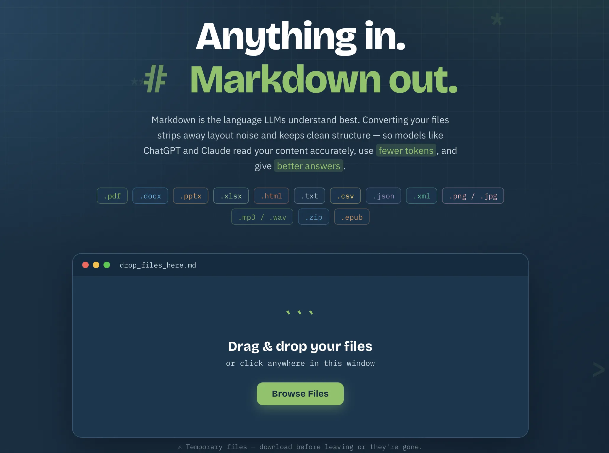

# Markdown Converter

**Anything in. Markdown out.**

Convierte cualquier documento a Markdown limpio y listo para LLMs: PDF, Office, imágenes (OCR), archivos y audio/video (transcripción con GPT-4o o Whisper local privado).



---

## Instalación (Español)

### Requisitos

- Python 3.10+ y FFmpeg
- Whisper local: Pop!_OS/Ubuntu con driver NVIDIA
- Transcripción cloud: `OPENAI_API_KEY`
- OCR opcional: `brew install tesseract` (macOS) / `apt-get install tesseract-ocr` (Linux)

### Opción A — Producción con systemd (recomendada)

Un solo comando desde el repositorio (Pop!_OS/Ubuntu):

```bash
git clone <repository-url> && cd markdown-converter
sudo ./install-systemd-service_new.sh
```

Instala todo en `/opt/markdown-converter`: dependencias, MarkItDown, usuario de servicio, modelo, `.env` y servicio habilitado al boot. Esta opción no requiere ejecutar `./script`. Sin GPU:

```bash
sudo INSTALL_LOCAL_WHISPER=0 ./install-systemd-service_new.sh
```

Clave OpenAI después de instalar, edita la línea `OPENAI_API_KEY=` en el archivo:

```bash
sudo nano /opt/markdown-converter/.env
# OPENAI_API_KEY=tu_clave_de_platform.openai.com/api-keys
sudo systemctl restart markdown-converter
```

### Opción B — Manual / desarrollo

El orden importa: ambos scripts comparten `.venv`.

```bash
git clone <repository-url> && cd markdown-converter
./script -i                    # 1. crea .venv + dependencias (sin sudo)
./install_whisper_local.sh     # 2. GPU: CUDA + modelo large-v3-turbo, escribe .env
nano .env                      # 3. opcional: OPENAI_API_KEY para cloud
.venv/bin/python app.py        # 4. arranca; carga .env automáticamente
```

Abre `http://SERVER_IP:8082`. El paso 2 es opcional si solo conviertes documentos o usas transcripción OpenAI; sin él, crea `.env` con `cp .env.example .env`.

La aplicación lee `.env` sola al arrancar (incluido `LD_LIBRARY_PATH` para CUDA); no hace falta `source .env`. Solo se necesita para comandos manuales de `faster-whisper` fuera de la app:

```bash
set -a; source .env; set +a
```

### Verificar

```bash
sudo systemctl status markdown-converter        # solo systemd
sudo journalctl -u markdown-converter -f        # solo systemd
curl -s http://127.0.0.1:8082/api/transcription/status
```

`local.available: true` = GPU lista.

---

## Installation (English)

### Prerequisites

- Python 3.10+ and FFmpeg
- Local Whisper: Pop!_OS/Ubuntu with NVIDIA driver
- Cloud transcription: `OPENAI_API_KEY`
- Optional OCR: `brew install tesseract` (macOS) / `apt-get install tesseract-ocr` (Linux)

### Option A — Production with systemd (recommended)

One command from the repository (Pop!_OS/Ubuntu):

```bash
git clone <repository-url> && cd markdown-converter
sudo ./install-systemd-service_new.sh
```

Installs everything into `/opt/markdown-converter`: dependencies, MarkItDown, service account, model, `.env`, and the service enabled at boot. This option does not require running `./script`. Without a GPU:

```bash
sudo INSTALL_LOCAL_WHISPER=0 ./install-systemd-service_new.sh
```

OpenAI key after installation:

```bash
sudo nano /opt/markdown-converter/.env
sudo systemctl restart markdown-converter
```

### Option B — Manual / development

Order matters: both scripts share the same `.venv`.

```bash
git clone <repository-url> && cd markdown-converter
./script -i                    # 1. creates .venv + dependencies (no sudo)
./install_whisper_local.sh     # 2. GPU: CUDA + large-v3-turbo model, writes .env
nano .env                      # 3. optional: OPENAI_API_KEY for cloud
.venv/bin/python app.py        # 4. starts; loads .env automatically
```

Open `http://SERVER_IP:8082`. Step 2 is optional if you only convert documents or use OpenAI transcription; without it, create `.env` with `cp .env.example .env`.

The app reads `.env` by itself at startup (including `LD_LIBRARY_PATH` for CUDA); no `source .env` needed. Only required for manual `faster-whisper` commands outside the app:

```bash
set -a; source .env; set +a
```

### Verify

```bash
sudo systemctl status markdown-converter        # systemd only
sudo journalctl -u markdown-converter -f        # systemd only
curl -s http://127.0.0.1:8082/api/transcription/status
```

`local.available: true` = GPU ready.

---

## Supported File Formats

- **Documents:** `.pdf`, `.docx`, `.pptx`, `.xlsx`, `.html`, `.txt`, `.csv`, `.json`, `.xml`
- **Images (OCR):** `.png`, `.jpg`, `.jpeg`, `.gif`, `.bmp`, `.tiff`
- **Archives:** `.zip`, `.epub`
- **Audio/video:** `.mp3`, `.wav`, `.m4a`, `.aac`, `.flac`, `.ogg`, `.webm`, `.mp4`

## Features

- Drag & drop, batch processing, live preview, copy/download
- Transcription engines: GPT-4o, GPT-4o with speaker diarization, or private Local Whisper (CUDA)
- OCR for images via Tesseract
- Temp files auto-deleted after 30 minutes; nothing persisted
- Upload limit 500 MB per file (override: `MAX_UPLOAD_SIZE_MB=1000 .venv/bin/python app.py`)

## Security & Privacy

- Files live only in temp directories, cleaned after 30 minutes
- Documents never leave the server; audio goes to OpenAI only when a GPT-4o engine is selected
- Local Whisper never makes API requests; direct audio/video uploads are never routed through MarkItDown
- All environment variables documented in [`.env.example`](.env.example); never commit a real key

## Architecture

Flask + MarkItDown + OpenAI SDK + faster-whisper + FFmpeg + Tesseract. Vanilla JS frontend, no build step.

```
app.py              # Flask server (loads .env via env_loader.py)
transcription.py    # cloud + local transcription engines
env_loader.py       # .env auto-load + LD_LIBRARY_PATH re-exec
templates/ static/  # web UI
```

## Tests

```bash
python3 -m unittest discover -s tests
```

## License

MIT License — See LICENSE file for details.
